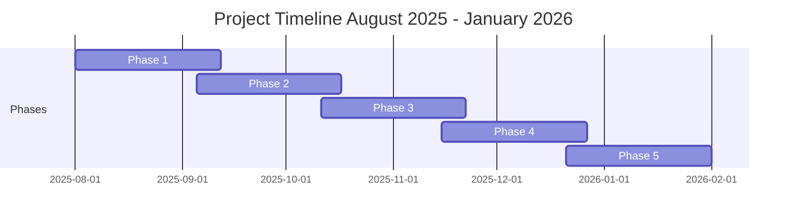

# Project Timeline

## 5-Phase Project Schedule (August 2025 - January 2026)

## Phase Details

- **Phase 1**: August 1 - September 11, 2025
- **Phase 2**: September 5 - October 16, 2025 (7-day overlap)
- **Phase 3**: October 11 - November 21, 2025 (6-day overlap)
- **Phase 4**: November 15 - December 26, 2025 (7-day overlap)
- **Phase 5**: December 21, 2025 - January 31, 2026 (6-day overlap)

Each phase lasts 6 weeks (42 days) with nearly equal overlaps (alternating 6-7 days) between consecutive phases, ensuring the project concludes exactly on January 31, 2026.
